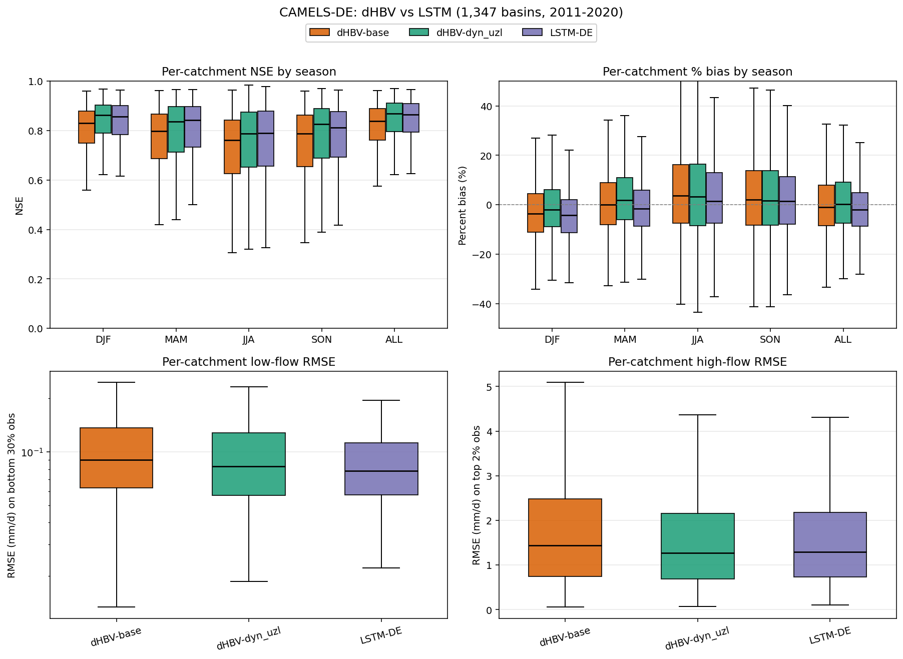

# dHBV (dyn_uzl) and LSTM on CAMELS-DE — release bundle

Single-file PyTorch forward + plotting code that reproduces the metrics figure
for **dHBV 1.1p (with parUZL added to the dynamic parameter set)** and an
**LSTM with catchment embedding** baseline, evaluated on the 1,347-basin
CAMELS-DE test split (2011-01-01 .. 2020-12-31).

> **Built on dMG — about one day's work end-to-end.** Both training and
> forward inference here use the
> [mhpi/generic_deltamodel](https://github.com/mhpi/generic_deltamodel)
> framework — its `ModelHandler`, `Trainer`, and `HydroLoader` are what
> `reproduce.py` calls under the hood, and the dHBV physics class
> (`Hbv_1_1p`) comes from the sibling
> [mhpi/hydrodl2](https://github.com/mhpi/hydrodl2) package. With dMG, going
> from a fresh dataset (CAMELS-DE) to a tuned, deployable differentiable
> hydrology model — including data ingestion, training, eval, and the
> seasonal-bias-driven `dyn_uzl` improvement — took about a single working
> day on one V100. Anyone who wants to retrain on new data, swap in a
> different differentiable hydrology model, or adapt the loss function
> should read the dMG docs first; they explain the config schema, data
> loader contract, and the dynamic-parameter mechanism that the `dyn_uzl`
> recipe exploits.



| Model | Median NSE | Median KGE | Median high-flow RMSE (top 2 % obs) | Median low-flow RMSE (bot 30 % obs) |
|---|---|---|---|---|
| dHBV-base    | 0.838 | 0.809 | 1.44 mm/d | 0.090 mm/d |
| dHBV-dyn_uzl | **0.869** | **0.838** | **1.28 mm/d** | 0.083 mm/d |
| LSTM-DE      | 0.866 | 0.826 | 1.30 mm/d | **0.078 mm/d** |

The published `Hbv_1_1p_Triton` GPU kernel produces forward outputs that match
this PyTorch forward to within fp32 rounding (median Δstreamflow = 0,
max |Δstreamflow| < 1.2 × 10⁻⁵ mm/d, max per-catchment ΔNSE < 3 × 10⁻⁶).
You therefore reproduce identical metrics using either kernel; this release
ships only the PyTorch path.

## Quick start

```bash
pip install -r requirements.txt

# 1. Get the data (one-time; ~3 GB):
bash data/download_camels_de.sh
python data/preprocess.py --raw data/raw --out data/

# 2. Run the forward + metrics:
python reproduce.py --root . --out-dir results/
```

Outputs (`results/`):
- `dhbv_streamflow.npy`, `lstm_streamflow.npy`, `streamflow_obs.npy`  (1347 × 3653)
- `metrics_boxplots.png`     four-panel figure: NSE/bias per season + low/high-flow RMSE
- `seasonal_summary.csv`     per-(season,model) median NSE and percent bias
- `flow_rmse_summary.csv`    per-model low- and high-flow RMSE medians

## What's in this bundle

```
release/
├── README.md                       this file
├── requirements.txt
├── reproduce.py                    single-file forward + metrics + plots
├── config/
│   └── config_dhbv_dyn_uzl.yaml    hydra config used for training; reused for forward
├── weights/
│   ├── dhbv_dyn_uzl_ep100.pt       dHBV neural-net checkpoint
│   ├── lstm_embedding.pt           LSTM catchment embedding state_dict
│   ├── lstm_decoder.pt             LSTM decoder state_dict
│   └── lstm_hparams.json           LSTM architecture hyperparameters
├── data/
│   ├── README.md                   data provenance + manual preprocessing notes
│   ├── download_camels_de.sh       wget the CAMELS-DE archive from Zenodo
│   └── preprocess.py               raw CAMELS-DE → camels_de.pkl + gage_info.npy
└── reference_results/              precomputed for byte-by-byte comparison
    ├── dhbv_streamflow.npy
    ├── lstm_streamflow.npy
    └── streamflow_obs.npy
```

## Train / test protocol

**Temporal split, no spatial holdout.** All 1,347 CAMELS-DE catchments are
used in both phases; the split is along the time axis.

| Phase | Window | Use |
|---|---|---|
| Train  | 1980-01-02 .. 2010-12-31 (31 yr) | parameter updates; each minibatch is a random 365-day window per basin (`rho=365`), batch_size=100, 100 epochs |
| Test   | 2010-01-01 .. 2020-12-31 (11 yr) | first 365 days are HBV warm-up (no scoring); all reported metrics are over **2011-01-01 .. 2020-12-31** (3,653 days × 1,347 catchments) |

Calendar year 2010 appears in both windows but never contributes to both the
*training loss* and the *test metrics*: the train sampler treats 2010 as just
another training year, while the test phase consumes 2010 only as warm-up to
initialise the HBV reservoir states before the 2011-2020 scoring window.
There is no separate validation split — model selection is by fixed
checkpoint (`test_epoch = 100`).

The LSTM baseline follows the same temporal split (train 1980-2010,
test 2011-2020, with a 365-day warm-up sliced from the test window in the
same way).

No trainer is included in this release — see
[mhpi/generic_deltamodel](https://github.com/mhpi/generic_deltamodel) for the
`Trainer` class, the `HydroLoader` data interface, and the YAML schema. The
exact configs we trained with are in `config/` here, so a reproduction run
under dMG only needs to point `--data-path` and `--gage-info` at the outputs
of `data/preprocess.py`.

## Training recipe (for reference)

- **dHBV**: `Hbv_1_1p` from [hydrodl2](https://github.com/mhpi/hydrodl2),
  `nmul=16`, dynamic_params = `[parBETA, parK0, parBETAET, parUZL]`,
  CudnnLstmModel(hidden=256, dropout=0.5), 365-day rho/warmup,
  Adadelta lr=1.0, `NseBatchLoss`, batch_size=100, 100 epochs, seed=111111.
- **LSTM**: catchment embedding (16-dim, Optuna-tuned) + 1-layer LSTM decoder
  (hidden=254) + 2-layer FC head (sizes [13, 5]) + linear projection to 1-dim
  daily Q. Hyperparameters pinned in `weights/lstm/hparams.json`.
- **Data split**: train 1980-01-02 .. 2010-12-31; test 2010-01-01 .. 2020-12-31
  (first 365 d of test are warm-up; metrics scored on 2011-2020).

## Citations

- Song, Yalan\*, Kamlesh Sawadekar\*, Jonathan M Frame, Ming Pan, Martyn Clark, Wouter J M Knoben, Andrew W Wood, Trupesh Patel, and Chaopeng Shen (2026), Physics-informed, Differentiable Hydrologic Models for Capturing Unseen Extreme Events. *Water Resources Research*, doi: [10.1029/2025WR040414](https://doi.org/10.1029/2025WR040414).
- Lonzarich and the MHPI team, *PyTorch Differentiable Modeling Framework*; https://github.com/mhpi/generic_deltamodel.
- Ji, Haoyu\*, Yalan Song\*, Tadd Bindas\*, Chaopeng Shen, Yuan Yang, Ming Pan, Jiangtao Liu\*, Farshid Rahmani\*, Ather Abbas, Hylke Beck, Kathryn Lawson\* and Yoshihide Wada. (2025). Distinct hydrologic response patterns and trends worldwide revealed by physics-embedded learning, *Nature Communications*, doi: [10.1038/s41467-025-64367-1](https://doi.org/10.1038/s41467-025-64367-1).
- Song, Yalan\*, Tadd Bindas\*, Chaopeng Shen, Haoyu Ji\*, Wouter J. M. Knoben, Leo Lonzarich\*, Martyn P. Clark, Jiangtao Liu\*, Katie van Werkhoven, Sam Lemont, Matthew Denno, Ming Pan, Yuan Yang, Jeremy Rapp, Mukesh Kumar, Farshid Rahmani\*, Cyril Thébault, Richard Adkins, James Halgren, Trupesh Patel, Arpita Patel, Kamlesh Sawadekar\*, and Kathryn Lawson\* (2025) *Water Resources Research*, High-resolution national-scale water modeling is enhanced by multiscale differentiable physics-informed machine learning, doi: [10.1029/2024WR038928](https://doi.org/10.1029/2024WR038928).
